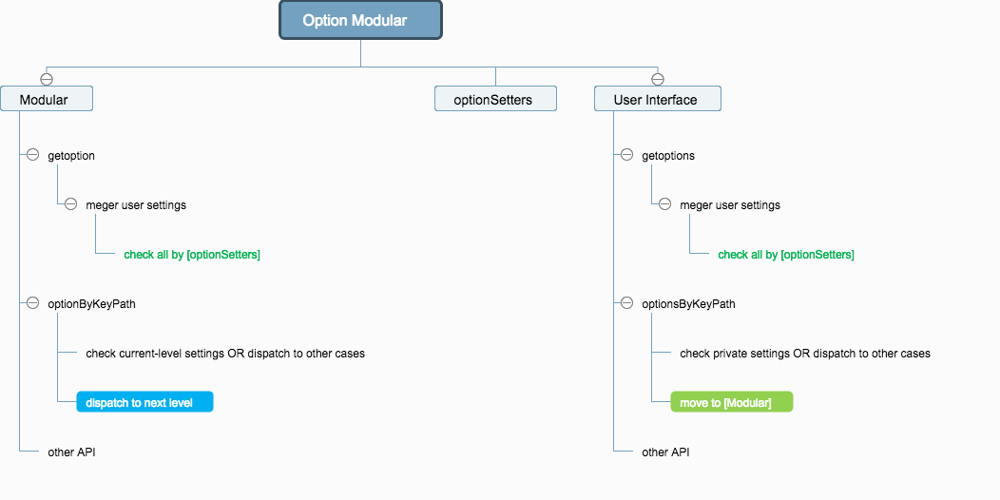

# option-modular

thinking on option by modular
一些关于 option 更新、验证、修正机制的尝试，可以极粒子化的进行校验、修正；

## Architecture

### 脑图

User Interface 和 Modular 思路类似、并行，但是针对的方向不同；




### 详解

#### 是什么

option-modular 是一种思想；当我们在实现一个插件、对外的接口、中间层这些时，都避免不了提供一些配置，更甚者还需要提供接口来随时更新这些配置；而当这份配置日渐庞大、层级过深时，用户只是更新其中的一个小配置项，如何能达到：最小粒度的验证用户输入的值是否正确，并做相应的响应；option-modular 提供这套机制，来简化验证、简化新配置项的加入同时不会伤害到现有配置项；

#### 场景

公共组件、图表插件、中大型中间层；

#### 思想

option-modular 将配置项进行 **分层**：Modular、User Interface 两层：

* Modular 层：更接近用户的层级；主要功能是：私有和个性化通用配置项的验证、移交 Modular 层进行通用验证；
* User Interface：通用配置项层级；主要功能是向下分发子级配置项的验证，会包含 N 层；

这两层都会涉及到“分发”的机制，就会用到分发器函数：*optionSetters* （函数定义在 others.js 文件中）；

所有的 *optionByKeyPath* 函数负责具体的 *case* 验证，并且在 *default case* 中需要有**移交**或**分发**的处理；

还有一些特殊情况，比如：集体的 *case* 可能还需要分发/跳转到其他 *case*（如：case 验证的 key 值是对象类型）；

#### 理解

请阅读具体的源码，并自定义一份配置做尝试使用：

* /scripts/components User Interface 层
* /scripts/option Modular 层
* index.js 入口文件，可以在该文件内尝试 options 的配置使用

#### 本地测试

切换到你的工作目录，分别执行以下命令，将源码克隆到你的本地，并安装所有依赖（需要 nodejs 环境）：

```
git clone https://github.com/WeiFei365/option-modular.git
cd option-modular
npm install
```

之后，在根目录执行： ```npm start```，然后打开浏览器输入：[http://localhost:8080/](http://localhost:8080/)，查看浏览器控制台的输出；
